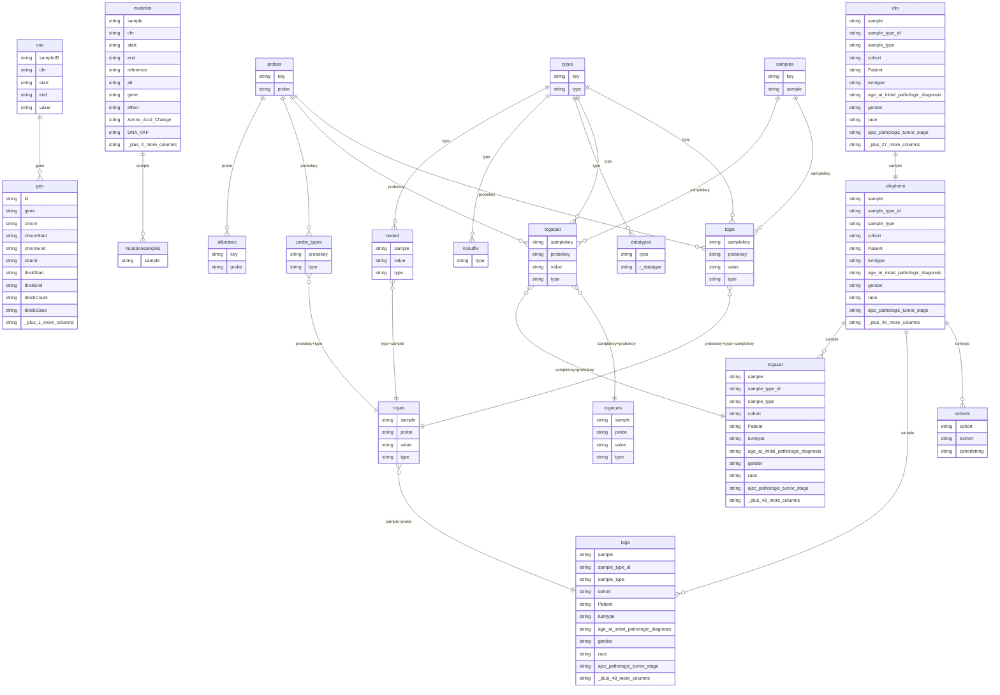

# Database Schema (ERD)

Generated: 2026-04-15 03:33:49.314464

## Indexes

| Table | Index | Columns |
|-------|-------|---------|
| clinpheno | clinphenoidx | sample |
| mutation | mutidx | gene |
| mutationsamples | mutationsamplesidx | sample |
| probe_types | probe_types_pk | probekey, type |
| probe_types | probe_types_tp | type, probekey |
| probes | probesidx |  probe  |
| samples | samplesidx |  sample  |
| tcgacati | tcgacatiidx_pts | probekey, type, samplekey |
| tcgai | typeidx |  type  |
| tcgai | tcgaiidx_pts | probekey, type, samplekey |
| tested | tested_type | type |
| tested | tested_type_sample | type, sample |

## Table Sizes

| Table | Type | Rows | Columns |
|-------|------|-----:|--------:|
| allprobes | table | 135,640 | 2 |
| clin | table | 12,804 | 37 |
| clinpheno | table | 12,804 | 55 |
| cnv | table | 1,790,483 | 5 |
| cohorts | table | 33 | 3 |
| datatypes | table | 19 | 2 |
| geo | table | 43,254 | 11 |
| mutation | table | 2,907,335 | 14 |
| mutationsamples | table | 9,104 | 1 |
| nosuffix | table | 3 | 1 |
| probe_types | table | 91,175 | 2 |
| probes | table | 135,603 | 2 |
| samples | table | 13,054 | 2 |
| tcgacati | table | 2,978,333 | 4 |
| tcgai | table | 577,415,719 | 4 |
| tested | table | 188,044 | 3 |
| types | table | 19 | 2 |
| tcga | view | (view) | 58 |
| tcgacat | view | (view) | 58 |
| tcgacats | view | (view) | 4 |
| tcgas | view | (view) | 4 |

